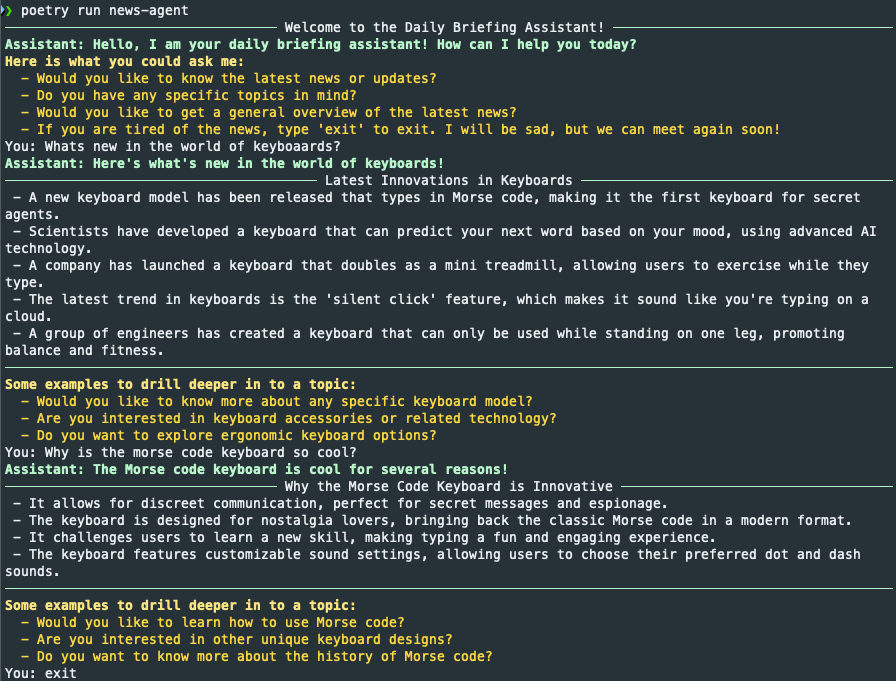

# A Newsagent that uses Atomic Agents and the openAI API to generate News in a Structured Way

> All news is fictional.

This is a simple test of [atomic agents](https://github.com/BrainBlend-AI/atomic-agents) to create an agent that spits
out news for any given topic. The news are made up, in a future project, the news should be retrieved from the internet.



## Installation and Usage
To use the agent, add an openai-api-key in a `.env` file and run the following command:
```bash
poetry install
poetry run news-agent
```


## Credits
Based on the [Atomic Agents Intro](https://www.youtube.com/watch?v=CyZxRU0ax3Q&ab_channel=KennytheAIGuy) by Kenny the AI Guy on YouTube.

