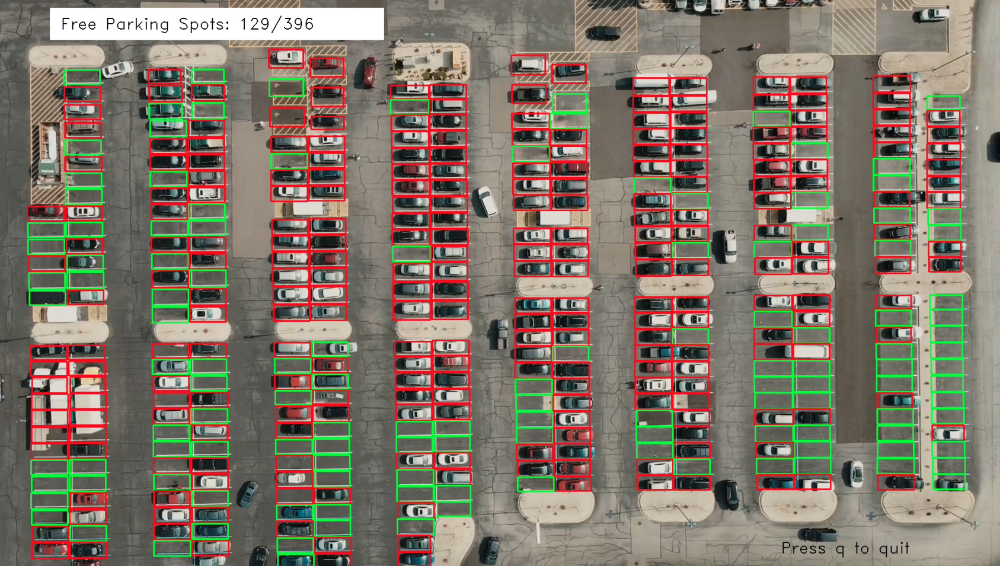

# Parking Spot Detection

A simple parking spot detection project using an SVM as classifier to derive the number of available parking spots from 
an aerial video in realtime.

This project is based on [computervisioneng/parking-space-counter](https://github.com/computervisioneng/parking-space-counter).
I added a simple data labeling pipeline and additional CLI controls, as well as minor rewrites for readability and performance.

### Data Prep
The script `prepData.py` loads the first frame from the video and extracts an image for each parking spot based on the mask.
For each image, the user can label it using the keys `y` and `n` for has as car or has no car respectively.
Cropped images are stored under `data/empty` and `data/not_empty`

### Model Training
`trainModel.py` loads the prepared images of parking spots, adds their flipped version and
performs a train and test split on them. On the train split, numerous SVC classifier are trained using grid search and
the best performing one is evaluated and stored.

Video data and mask are available [here](https://drive.google.com/drive/folders/1CjEFWihRqTLNUnYRwHXxGAVwSXF2k8QC?usp=sharing).

